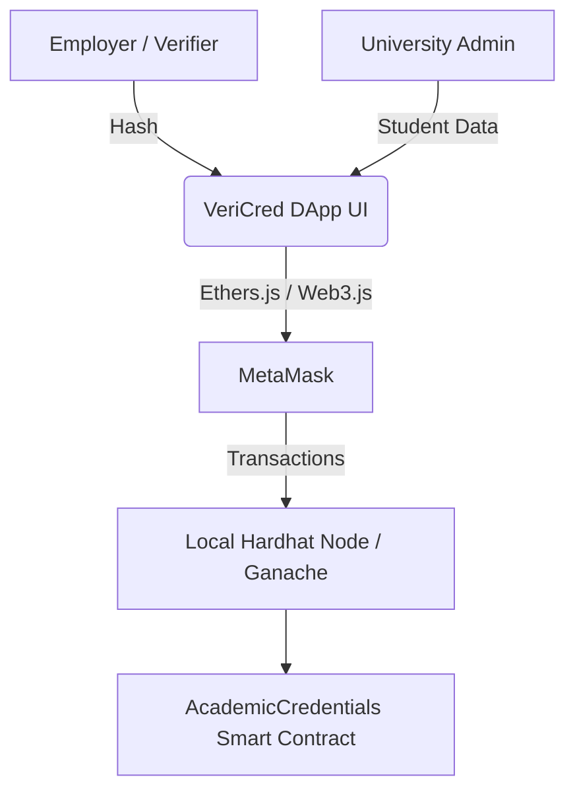

# Academic Credential Verification DApp

## 1. Project Title & Description
**VeriCred: Academic Credential Verification DApp**
VeriCred is a decentralized application designed to combat fraud in academic certifications. It allows universities to instantly issue tamper-proof degrees on the blockchain, gives students permanent ownership of their records, and permits employers to verify credentials in milliseconds without manual university confirmations.

## 2. Team Members
- Hariharan NKS - 9599319

## 3. System Architecture

- **Frontend Layer:** Built using React, Vite, and aesthetic TailwindCSS glassmorphism.
- **Web3 Provider Layer:** MetaMask facilitates user connections and signs transactions.
- **Blockchain Layer:** Local Hardhat/Ganache instances executing EVM bytecode.

## 4. Technologies Used
- **Smart Contract:** Solidity (v0.8.20), Hardhat Framework
- **Frontend Development:** React 19, Vite
- **Web3 Integration:** Ethers.js (v6)
- **Styling:** TailwindCSS v4, Lucide React (Icons)
- **Testing:** Mocha, Chai

## 5. Prerequisites
- **Node.js:** v18.0 or newer
- **MetaMask Extension:** Installed in your Chromium-based browser (Chrome, Edge, Brave).
- **Git**