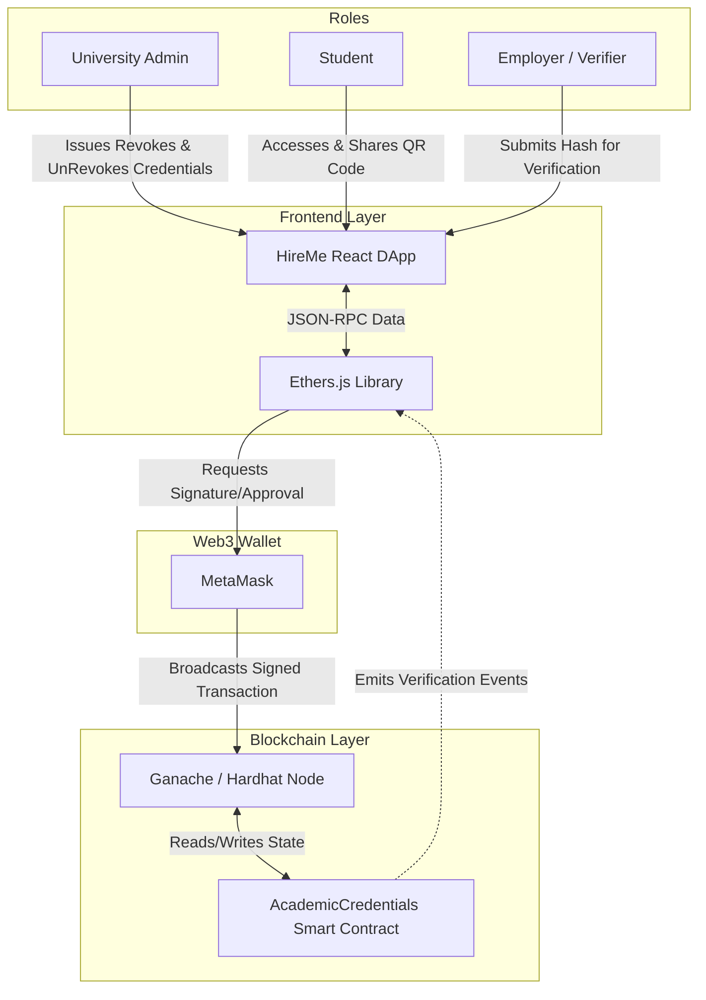

# HireMe: Academic Credential Verification DApp

**HireMe** is a decentralized application designed to combat fraud in academic certifications. It allows universities to issue verified academic credentials on the Ethereum Blockchain. Students can securely share their credentials with employers, and employers can instantly verify them without manual university confirmations.

---

## 1. Team Members

- **Hariharan NKS** - 9599319
- **Kusha Latha Azmeera** - 8884869
- **Om Kurbakhelgi** - 7408249
- **Yushen** - 

---

## 2. System Architecture

The architecture is built on three pillars: **Data Integrity**, **Identity Management**, and **Verifiable State**.



### Infrastructure Overview

- **Frontend Application:** A simple frontend application using dapp-generator.js and responsive React.js based interface tailored for the varied workflows of all three user roles (Admin, Student, Verifier).
- **Web3 Provider Integration:** Utilizes Ethers.js and MetaMask to securely manage identities, sign transactions, and interact with the blockchain ecosystem without exposing private keys.
- **Data Structure:** Uses a `Credential` struct within an on-chain mapping for gas-efficient, highly direct retrieval of academic records.
- **Hashing Mechanism:** Computes a unique Keccak-256 "digital fingerprint" for every certificate, inherently combining data with timestamps to prevent any hash collisions.
- **State Management:** Credentials exist in immutable states across the ledger: *Non-Existent*, *Active*, or *Revoked*, generating a permanent and transparent audit trail.

---

## 3. Technologies Used

- **Blockchain Platform:** Ethereum (Local Ganache/Hardhat)
- **Languages:** Solidity (v0.8.20), JavaScript
- **Frameworks:** React.js, Vite, Hardhat
- **Web3 Integration:** Ethers.js
- **Style:** TailwindCSS with Glassmorphism
- **Wallet:** MetaMask

---

## 4. Prerequisites

- **Node.js:** v18.0+
- **MetaMask Extension:** Installed in your web browser.
- **Ganache GUI:** For local blockchain stimulation.
- **Git:** To clone and manage the project repository.

---

## 5. Installation & Setup Instructions

### 1. Project Initialization

```bash
git clone https://github.com/harinks/ACADEMIC-CREDENTIALS-DAPP.git
cd ACADEMIC-CREDENTIALS-DAPP
npm install
npx hardhat compile
```

### 2. Local Blockchain (Ganache) Configuration

1. Open Ganache GUI.


2. Select **New Workspace** and set Hostname to `127.0.0.1` and Port to `7545`.
3. Set Network ID to `1337`.


### 3. MetaMask Integration (Dual Account Setup)

To fully demonstrate the DApp, you must import two distinct roles from Ganache: the **University Admin** and the **Student**.

#### Step A: Configure Custom Network

In MetaMask, navigate to **Settings > Networks > Add a network manually**:

- **Network name:** Ganache GUI
- **New RPC URL:** `http://127.0.0.1:7545`
- **Chain ID:** `1337`
- **Currency symbol:** `ETH`


#### Step B: Adding the University Account (Index 0)

1. In Ganache, find the account at **Index 0** and reveal the Private Key using the **Key Icon**.
2. In MetaMask, go to **Import Account** and paste the key.


#### Step C: Adding the Student Account (Index 1)

Repeat the import process for the account at **Index 1** in Ganache to act as the recipient.


### 4. Smart Contract Deployment

Use Hardhat to deploy the `AcademicCredentials` contract:

```bash
npx hardhat run scripts/deploy.js --network ganache
```


Verify the deployment in Ganache by checking the incremented block height and the **Contract Creation** badge.


---

## 6. Smart Contract Functions

The `AcademicCredentials` contract is the core logic engine of the system.

### Core Logic & Security

- **Collision Resistance:** By including student data and `block.timestamp` in the Keccak-256 hash, we ensure that even identical degree titles for the same student generate unique IDs.
- **Input-Sensitivity:** Any change (e.g., "John" to "Jon") results in a completely different hash.
- **Audit Trail:** Instead of deleting records, we toggle a `revoked` flag. This creates a permanent, immutable history on the ledger.

### Detailed Functionality

- **`issueCredential` (Write)**: Admin only. Packages metadata, generates the hash, and ensures the hash hasn't been minted previously.
- **`revokeCredential` (Update)**: Admin only. Changes the `revoked` boolean to `true`. Crucial for invalidating degrees issued in error.
- **`unrevokeCredential` (Update)**: Admin only. Restores a degree to active status.
- **`verifyCredential` (Read)**: Public. Checks `exists && !revoked`. Used for instant third-party validation.
- **`getCredential` (Read)**: Public. Returns the full struct (Name, University, Degree, Field) for more detailed inspection.

---

## 7. Testing Instructions

Run the automated test suite (9 passing assertions) to verify security and logic:

```bash
npx hardhat test
```


**Assertion Areas:**

- **Deployment:** Proper Admin assignment.
- **Security:** Reverting unauthorized (non-admin) issuance/revocation attempts.
- **Lifecycle:** Validating state transitions from Issued -> Revoked -> Unrevoked.
- **Edge cases:** Handling double-revocation or non-existent hashes.

---

## 8. Frontend Configuration (Contract Address Setup)

After deployment, update the contract address in your configuration files to sync the frontend with the blockchain.

1. **Update `contract-address.json`:** Paste the generated contract address into the `"address"` field.
2. **Update `app.js` (Simple Frontend):** Ensure the `CONTRACT_ADDRESS` constant in `simple-frontend/app.js` is updated.


---

## 9. Launching the Simple Frontend

Start a lightweight web server to interact with the DApp locally:

1. **Generate Frontend Files** (if required):

   ```bash
   node dapp-generator.cjs artifacts/contracts/AcademicVerification.sol/AcademicCredentials.json --address <CONTRACT_ADDRESS> --out ./simple-frontend
   ```

   

2. **Launch Server:**

   ```bash
   cd simple-frontend
   npx http-server -p 3000
   ```

   

3. **Access:** Open `http://localhost:3000` in your browser.

---

## 10. User Guide (Detailed Walkthrough)

### 1. Connecting MetaMask

Authorize the connection between your wallet and the frontend.


### 2. Issuing a Credential (University Role)

Fill in the student's details and confirm the transaction in MetaMask.


### 3. Verifying & Extracting Hashes

Locate the `credentialHash` in the **Contract Events** panel. Use this hash in the `getCredential` or `verifyCredential` sections.


### 4. Revocation & Restoration

Admins can revoke a hash which instantly sets `verifyCredential` to `false`.


Reinstating it is equally simple via `unrevokeCredential` to `true`.


### 5. Final Audit

You can verify the exact gas consumption and transaction details in the Ganache GUI.


---

## 11. Enhanced Frontend Setup

For the production-ready React app with premium visuals:

1. **Installation:**

   ```bash
   cd frontend
   npm install
   ```

2. **Configure Environment:**
   Ensure `src/contracts/config.js` points to your local Ganache contract address and Chain ID 1337.

   

3. **Execution:**

   ```bash
   npm run dev
   ```

4. **Access:** Open `http://localhost:5173`.

### Visual Walkthrough of the Enhanced Interface

1. **Step 1: Landing Page & Initial Wallet Connection:** The user starts at the "VeriCred" landing page, which features a clean, professional design. The user clicks the prominent "Connect Wallet" button, and a MetaMask popup appears requesting a connection. The administrator selects the "University Account" to establish their authority.

   

2. **Step 2: Dashboard Access & Role Verification:** Upon connecting, the dashboard updates to show the user's active session. A badge clearly identifies the "Role: Administrator" and displays the connected university wallet address. The user then navigates to the "University Control Center."

   

3. **Step 3: University Control Center – Issuing a Credential:** The administrator enters the secure management area to issue credentials. They fill out the issuance form with the student's specific data (e.g., Name: Hari, Degree: MDT in CS, and the student's unique Wallet Address). Submitting triggers a MetaMask "Confirm Transaction" prompt to sign the data onto the blockchain.

   

4. **Step 4: Real-time Ledger Update:** Once the transaction is mined, the "Global Issuance Ledger" (a centralized table of all credentials) updates in real-time. A new entry for the student appears with a status of "Active", alongside the unique cryptographic hash that serves as their permanent credential ID.

   

5. **Step 5: Public Verification Portal – Entering the Hash:** An employer or verifier navigates to the "Public Verification Portal" (using a standard Student/Public Account). They paste the unique Cryptographic Hash obtained from the ledger into the search field and click "Verify Now".

   

6. **Step 6: Verification Success – "Verified & Authentic":** The DApp queries the smart contract and instantly returns a detailed verification card confirming the Holder Identity (Hari), Issuing Institution (UOWD), and Awarded Distinction (MDT in CS) with a large green checkmark, proving the certificate's cryptographic authenticity.

   

7. **Step 7: QR Code Generation for Instant Sharing:** A specialized modal labeled "Scan Verify QR" generates a unique QR code linked directly to the on-chain record for the specific credential. The student can share this QR code on platforms like LinkedIn; any employer scanning it is taken directly to the blockchain verification result.

   

---

## 12. Known Issues & Limitations

- **Gas Costs:** Raw string storage on EVM is computationally expensive (~146k gas for issuance).
- **Privacy:** While not explicitly displayed in the basic Ganache GUI (which primarily shows transaction hashes), the metadata (like student names and degrees) is permanently stored in the contract's state on the EVM. Anyone with the contract address and ABI can publicly read this data by calling the contract's read functions or decoding the transaction logs.
- **Centralization Risk:** The current architecture relies heavily on the `University Admin` address as a single point of failure. If the admin's private key is compromised, attackers could issue fraudulent credentials or revoke legitimate ones.
- **Smart Contract Upgradability:** The current `AcademicCredentials` contract cannot be upgraded. If a critical bug is discovered or a feature needs to be added later, a completely new contract must be deployed, breaking the historical continuity of the previous credential ledger.

---

## 13. Future Improvements

- **IPFS + Encryption Integration:** Moving heavy metadata off-chain to IPFS to significantly lower gas fees, combined with asymmetric encryption to ensure that only authorized employers can read the publicly stored IPFS files.
- **Multi-Signature Wallets (DAO Governance):** Implementing a multi-sig contract (like a Gnosis Safe) for the admin role, requiring multiple university officials to sign off on credential issuance and revocation to prevent single-key compromise.
- **Soulbound Tokens (SBTs):** Transitioning from simple struct mappings to utilizing ERC-5192 (Soulbound Tokens) to represent degrees as non-transferable NFTs attached specifically to the student's identity wallet.
- **Batch Issuance:** Implementing a function in the smart contract that takes an array of student data, allowing the university to issue hundreds of credentials in a single transaction (e.g., at graduation time), saving time and bulk gas fees.

---

## 14. How to Preview this README

- **VS Code:** Press `Cmd + Shift + V`.
- **Online Tool:** [Dillinger.io](https://dillinger.io/)

---

© 2026 HireMe Team. Technical Documentation.
