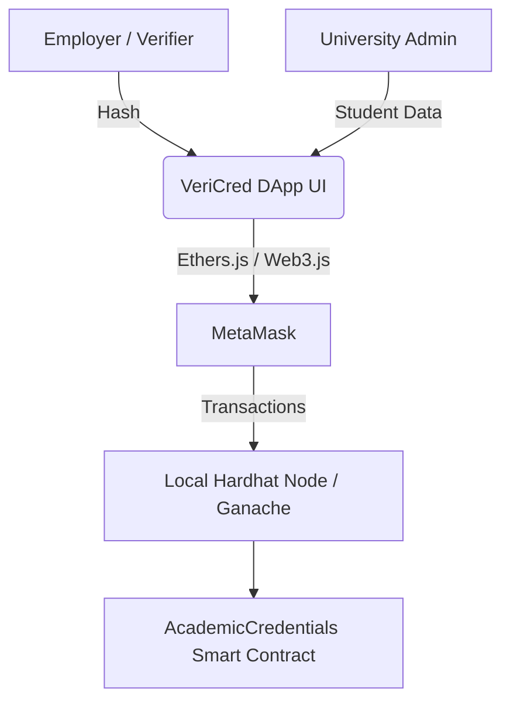

# HireMe: Academic Credential Verification DApp

HireMe is a decentralized application designed to combat fraud in academic certifications. It allows universities to issue verified academic credentials on the Ethereum Blockchain. Students can securely share their credentials with employers, and employers can instantly verify them without manual university confirmations.

---

## 2. Team Members

- **Hariharan NKS** - 9599319
- **Kusha Latha Azmeera** - 8884869 (Frontend Developer)
- **Om**
- **Yushen**

---

## 3. Features

- **On-chain Issuance:** Securely issue academic credentials.
- **Unique Hashing:** Automatic generation of unique credential digital fingerprints.
- **Public Verification:** Anyone can verify a credential using its unique hash.
- **Revocation Control:** Universities can revoke invalid or fraudulent credentials.
- **Restoration (Unrevoke):** Capability to reinstate previously revoked credentials.
- **Event Logging:** Transparent tracking of all on-chain activities.

---

## 4. System Architecture



The architecture is built on three pillars: **Data Integrity**, **Identity Management**, and **Verifiable State**.

### Roles

- **University/Admin:** The authorized issuer who deploys the contract and manages credentials (issue, revoke, restore).
- **Students:** The recipients of the credentials.
- **Employers/Verifiers:** Third parties who use the public verification system.

### Technical Layers

- **Frontend Layer:** Built with React, Vite, and Vanilla CSS/TailwindCSS.
- **Web3 Provider Layer:** MetaMask facilitates user connections and signs transactions.
- **Blockchain Layer:** Local Hardhat/Ganache instances executing EVM bytecode.

### Data Structure & Lifecycle
The contract uses a `Credential` struct stored in a high-speed mapping: `mapping(bytes32 => Credential)`.
1. **Non-Existent:** Hash never registered.
2. **Active:** Hash exists and is valid (`revoked = false`).
3. **Revoked:** Hash exists but marked invalid (`revoked = true`).

---

## 5. Technologies Used

- **Smart Contract:** Solidity (v0.8.20), Hardhat Framework
- **Frontend:** React.js, Javascript
- **Web3 Integration:** Ethers.js, MetaMask Wallet
- **Testing:** Hardhat, Mocha, Chai

---

## 6. Smart Contract Functions

### Write Operations (Admin Only)
- **`issueCredential(address _student, string _name, string _university, string _degree, string _field)`**
  Computes a Keccak-256 hash (digital fingerprint) and stores metadata. Triggers `CredentialIssued`.
- **`revokeCredential(bytes32 _credentialHash)`**
  Updates the `revoked` flag to `true` for an existing credential. Triggers `CredentialRevoked`.
- **`unrevokeCredential(bytes32 _credentialHash)`**
  Restores a revoked credential to active status. Triggers `CredentialUnrevoked`.

### Read Operations (Public)
- **`getCredential(bytes32 _credentialHash)`**
  Retrieves full individual record details including status.
- **`verifyCredential(bytes32 _credentialHash)`**
  Returns a simple boolean if the credential is both existent and active.

---

## 7. Prerequisites
- **Node.js:** v18.0 or newer
- **MetaMask Extension:** Installed in Chrome/Brave browser.
- **Git** to clone and manage the project repository.
- **Hardhat/Ganache:** Local Ethereum development environment.

---

## 8. User Guide & Setup

### 1. Installation
```bash
git clone https://github.com/username/credential-dapp.git
cd credential-dapp
npm install
npx hardhat compile
```

### 2. Local Blockchain Configuration (Ganache)
1. Open Ganache and click **NEW WORKSPACE**.
2. **Server Settings:** Set Hostname to `127.0.0.1` and Port to `7545`.
3. **Network ID:** Set to `1337`.


### 3. MetaMask Integration
1. Add a Custom Network:
   - Network Name: Ganache GUI
   - RPC URL: `http://127.0.0.1:7545`
   - Chain ID: `1337`
   - Symbol: `ETH`
2. Import accounts from Ganache using their **Private Keys**.


### 4. Deployment
Run the deployment script:
```bash
npx hardhat run scripts/deploy.js --network ganache
```
Verify the success in Ganache (Block height should increment to 1).


### 5. Launching the DApp
Update the `contract-address.json` (or designated config) with the newly generated address, then:
```bash
# Generate frontend if needed
node dapp-generator.cjs artifacts/contracts/AcademicVerification.sol/AcademicCredentials.json --address <CONTRACT_ADDRESS> --out ./simple-frontend

# Launch server
cd simple-frontend
npx http-server -p 3000
```
Visit `http://localhost:3000` and connect MetaMask.


### 6. Enhanced Frontend Setup (Production/Advanced)

For the full-featured React application with enhanced UI/UX:

```bash
cd frontend
npm install
npm run dev
```

This will start a Vite development server (usually at `http://localhost:5173`).

---

## 9. Operation Workflow

### Issuing a Credential
1. Fill in student details in the **issueCredential** panel.
2. Confirm the transaction in MetaMask.
3. Locate the `credentialHash` in the **Contract Events** log at the bottom.


### Verification & Revocation
- **Verification:** Paste the hash into `verifyCredential` to check validity.
- **Revocation:** Admin can paste the hash into `revokeCredential` to invalidate a degree.


---

## 10. Testing Instructions
Run automated security and logic tests:
```bash
npx hardhat test
```
The suite confirms:
- Admin-only access control.
- Successful issuance and hash generation.
- Full revocation and reinstatement lifecycle.
- Error handling for duplicate issuance or unauthorized calls.

---

## 11. Known Issues & Future Improvements

### Current Limitations
1. **On-Chain Storage Costs:** Storing raw strings is expensive on Mainnet.
2. **Data Privacy:** PII is currently public; no ZK-proofs or encryption used yet.
3. **Centralization:** Admin role is a single point of failure (Single-sig).

### Future Roadmap
- **IPFS Integration:** Store heavy metadata off-chain, keeping only CIDs on-chain.
- **Multi-Signature Admin:** Use Gnosis Safe for decentralized governance.
- **Soulbound Tokens (SBTs):** Implement ERC-5192 for non-transferable degree NFTs.
- **Batch Issuance:** Support CSV uploads for registrar efficiency.

---

## 12. How to Preview this README
Before pushing your changes to GitHub, you can preview this document to ensure formatting is correct:
- **VS Code:** Open the file and press `Cmd + Shift + V` (macOS) or `Ctrl + Shift + V` (Windows).
- **Online Tools:** Copy the content into [Dillinger.io](https://dillinger.io/) or [StackEdit.io](https://stackedit.io/).
- **Extension:** Use the "Markdown Preview Enhanced" extension in VS Code for a more accurate GitHub-style render.

---

© 2026 HireMe Team. Technical documentation for Academic Credential Verification.
