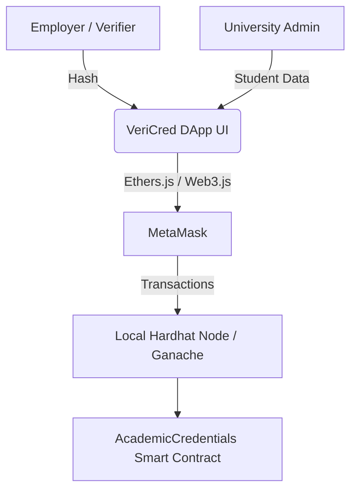

# HireMe: Academic Credential Verification DApp

**HireMe** is a decentralized application designed to combat fraud in academic certifications. It allows universities to issue verified academic credentials on the Ethereum Blockchain. Students can securely share their credentials with employers, and employers can instantly verify them without manual university confirmations.

---

## 1. Team Members
- **Hariharan NKS** - 9599319
- **Kusha Latha Azmeera** - 8884869 (Frontend Developer)
- **Om**
- **Yushen**

---

## 2. System Architecture

The architecture is built on three pillars: **Data Integrity**, **Identity Management**, and **Verifiable State**.



### Infrastructure Overview
- **Data Structure:** Uses a `Credential` struct within a mapping for high-speed retrieval.
- **Hashing Mechanism:** Computes a Keccak-256 "digital fingerprint" for every certificate, including timestamps to prevent collisions.
- **State Management:** Credentials exist in three states: *Non-Existent*, *Active*, or *Revoked*.

---

## 3. Technologies Used
- **Blockchain Platform:** Ethereum (Local Ganache/Hardhat)
- **Languages:** Solidity (v0.8.20), JavaScript
- **Frameworks:** React.js, Vite, Hardhat
- **Web3 Integration:** Ethers.js
- **Style:** TailwindCSS with Glassmorphism
- **Wallet:** MetaMask

---

## 4. Prerequisites
- **Node.js:** v18.0+
- **MetaMask Extension:** Installed in your web browser.
- **Ganache GUI:** For local blockchain stimulation.
- **Git** to clone and manage the project repository.

---

## 5. Installation & Setup Instructions

### 1. Project Initialization
```bash
git clone https://github.com/username/credential-dapp.git
cd credential-dapp
npm install
npx hardhat compile
```

### 2. Local Blockchain (Ganache) Configuration
1. Open Ganache GUI.
2. Select **New Workspace** and set Hostname to `127.0.0.1` and Port to `7545`.
3. Set Network ID to `1337`.


### 3. MetaMask Integration (Dual Account Setup)

To fully test the DApp, you must import both the **University Admin** and **Student** accounts.

#### A. Configure Custom Network
Add a new network in MetaMask:
- **Network name:** Ganache GUI
- **New RPC URL:** `http://127.0.0.1:7545`
- **Chain ID:** `1337`
- **Currency symbol:** `ETH`


#### B. Importing Accounts
1. In Ganache, click the **Key Icon** for Index 0 (University Admin). Copy the Private Key.
2. In MetaMask, select **Import Account** and paste the key.
3. Repeat the process for Index 1 (Student Account).


### 4. Smart Contract Deployment
```bash
npx hardhat run scripts/deploy.js --network ganache
```
Verify that the Block Height in Ganache increments and gas is consumed from the Account 0 balance.


---

## 6. Smart Contract Functions

The `AcademicCredentials` contract is the core logic engine of the system.

### Core Logic & Security
- **Collision Resistance:** By including student data and `block.timestamp` in the Keccak-256 hash, we ensure that even identical degree titles for the same student generate unique IDs.
- **Input-Sensitivity:** Any change (e.g., "John" to "Jon") results in a completely different hash.
- **Audit Trail:** Instead of deleting records, we toggle a `revoked` flag. This creates a permanent, immutable history on the ledger.

### Detailed Functionality
- **`issueCredential` (Write)**: Admin only. Packages metadata, generates the hash, and ensures the hash hasn't been minted previously.
- **`revokeCredential` (Update)**: Admin only. Changes the `revoked` boolean to `true`. Crucial for invalidating degrees issued in error.
- **`unrevokeCredential` (Update)**: Admin only. Restores a degree to active status.
- **`verifyCredential` (Read)**: Public. Checks `exists && !revoked`. Used for instant third-party validation.
- **`getCredential` (Read)**: Public. Returns the full struct (Name, University, Degree, Field) for more detailed inspection.

---

## 7. Testing Instructions

Run the automated test suite (9 passing assertions) to verify security and logic:
```bash
npx hardhat test
```
**Assertion Areas:**
- **Deployment:** Proper Admin assignment.
- **Security:** Reverting unauthorized (non-admin) issuance/revocation attempts.
- **Lifecycle:** Validating state transitions from Issued -> Revoked -> Unrevoked.
- **Edge cases:** Handling double-revocation or non-existent hashes.

---

## 8. User Guide (Role-Based)

### A. University / Admin (Issuing Degrees)
1. **Connect:** Click "Connect MetaMask" and select the University Account.
2. **Issue:** Navigate to the `issueCredential` panel. Enter the student's public address and academic details.
3. **Sign:** Click "Call issueCredential()". Confirm the gas fee in the MetaMask popup.


### B. Employers & Verifiers (Authentication)
1. **Get Hash:** Receive the unique hexadecimal hash from the candidate.
2. **Verify:** Paste the hash into the `verifyCredential` panel. If valid, the DApp returns `true`.
3. **View Records:** Use `getCredential` to see the student's full verified profile.


### C. Auditing & Revocation
To invalidate a credential, the admin paste the hash into the `revokeCredential` panel.


---

## 9. Enhanced Frontend Setup (Production)

For the full-featured React application with high-performance UI components and Vite-optimized bundling.

### Step-by-Step Setup
1. **Navigate to Directory:**
   ```bash
   cd frontend
   ```
2. **Install Production Deps:**
   ```bash
   npm install
   ```
3. **Configure Environment:**
   Ensure `src/contracts/config.js` points to your local Ganache contract address and Chain ID 1337.
4. **Launch Dev Server:**
   ```bash
   npm run dev
   ```

### UI Features
- **Glassmorphism:** Aesthetic transparency effects for a premium feel.
- **Real-time Logs:** Displays recent contract events (Issuance/Revocations) directly in the UI.
- **Dynamic Connection:** Status indicators turn green upon successful wallet authorization.


---

## 10. Known Issues & Limitations
- **Storage Scalability:** Raw string storage on the EVM involves high gas costs (~150k gas for issuance).
- **Public Privacy:** Metadata is currently visible to anyone, raising GDPR/PII concerns.
- **UX Friction:** Requires manual MetaMask network configuration for local testing.
- **Centralization:** Admin address acts as a single point of failure.

---

## 11. Future Improvements
- **IPFS Integration:** Store certificate metadata off-chain to reduce gas costs.
- **Multi-Signature Control:** Require multiple registrar signatures for revocations via Gnosis Safe.
- **Zero-Knowledge Proofs:** Verify graduation status without revealing the student's identity.
- **Soulbound Tokens (SBTs):** Issue degrees as non-transferable ERC-5192 tokens.

---

## 12. How to Preview this README
- **VS Code:** Press `Cmd + Shift + V`.
- **Online Tools:** Use [Dillinger.io](https://dillinger.io/) for a live render of this Markdown file.

---
© 2026 HireMe Team. Decentralized Academic Verification Documentation.
