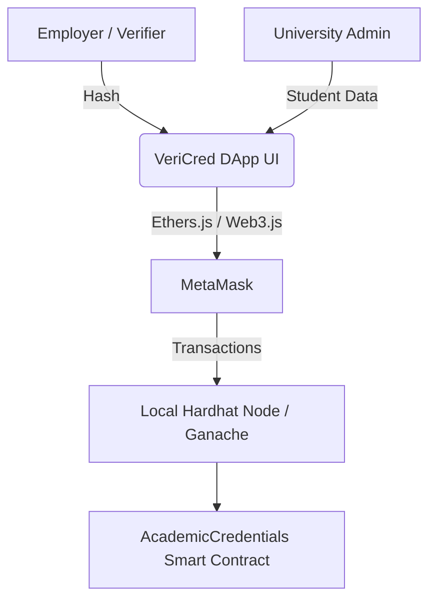

# Academic Credential Verification DApp

## 1. Project Title & Description
**VeriCred: Academic Credential Verification DApp**
VeriCred is a decentralized application designed to combat fraud in academic certifications. It allows universities to instantly issue tamper-proof degrees on the blockchain, gives students permanent ownership of their records, and permits employers to verify credentials in milliseconds without manual university confirmations.

## 2. Team Members
- [Student Name] - [Student ID]
- *(Add other team members here if necessary)*

## 3. System Architecture

- **Frontend Layer:** Built using React, Vite, and aesthetic TailwindCSS glassmorphism.
- **Web3 Provider Layer:** MetaMask facilitates user connections and signs transactions.
- **Blockchain Layer:** Local Hardhat/Ganache instances executing EVM bytecode.

## 4. Technologies Used
- **Smart Contract:** Solidity (v0.8.20), Hardhat Framework
- **Frontend Development:** React 19, Vite
- **Web3 Integration:** Ethers.js (v6)
- **Styling:** TailwindCSS v4, Lucide React (Icons)
- **Testing:** Mocha, Chai

## 5. Prerequisites
- **Node.js:** v18.0 or newer
- **MetaMask Extension:** Installed in your Chromium-based browser (Chrome, Edge, Brave).
- **Git**

## 6. Installation & Setup Instructions

### 1. Hardhat Setup & Deployment
First, install dependencies and spin up the local blockchain.
```bash
# Install hardhat & dependencies
npm install

# In Terminal 1: Start the local hardhat node (acting like Ganache at port 7545)
npx hardhat node --port 7545

# In Terminal 2: Deploy the main contract
npx hardhat run scripts/deploy.js --network ganache
```
Take note of the contract deployment address.

### 2. Frontend Execution

**Option A - Professor's Simple DApp:**
```bash
npx http-server ./simple-frontend -p 3000
# Open http://localhost:3000
```

**Option B - Premium React VeriCred UI:**
```bash
cd frontend
npm install
npm run dev
# Open http://localhost:5173
```

## 7. Smart Contract Functions
`AcademicCredentials.sol`
- `issueCredential(address, string, string, string, string) -> bytes32`: Creates a new cryptographic hash using student data & timestamps and stores it. Admin only. 
- `verifyCredential(bytes32) -> bool`: Checks if a hash is registered and has not been revoked. Any address.
- `revokeCredential(bytes32)`: Marks a credential logic flag as revoked. Admin only.
- `getCredential(bytes32) -> Tuple`: Returns all structural data of the given hash.

## 8. User Guide
1. **Connect MetaMask:** Open the application and click "Connect Wallet". Ensure your MetaMask is pointing to `Localhost 1337` or your Ganache RPC.
2. **Issue (As Admin):** Input the student wallet, name, university, degree, and field. Sign the transaction. Save the output Hash.
3. **Verify:** Anyone can input the output Hash into the "Verify Credential" panel. It will query the blockchain and return the status (Valid or Revoked) and document metadata seamlessly.
4. **Revoke (As Admin):** Paste the issued Hash and revoke the certificate permanently if needed.

## 9. Testing Instructions
The smart contracts undergo rigorous testing. To deploy unit tests simulating the interaction graph:
```bash
# In the root folder
npx hardhat test
```
*At least 5 exhaustive checks ensure admins have exclusive control over issuance/revocation and standard checks validate structural integrity.*

## 10. Known Issues/Limitations
- The current implementation only supports one specific admin address set identically on deployment. Cannot add secondary administrators yet.
- Credentials rely on the generated `bytes32` hash; there is no secondary query index (e.g. searching by Address) directly mapped within the frontend.

## 11. Future Improvements
- Implement Role-Based Access Control (RBAC) to allow multi-university interoperability.
- Map hashes directly to student wallets so a student can auto-load a list of their owned credentials without manually tracking hashes.
- IPFS integration for hosting actual PDF representations of the certificates.
